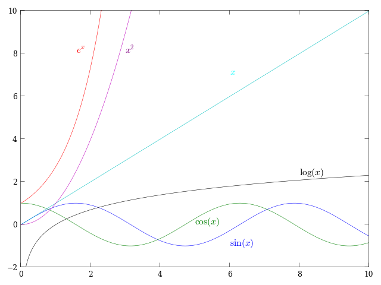

.. Compléments de mathématiques documentation master file, created by
   sphinx-quickstart on Tue Jul 31 21:20:33 2012.
   You can adapt this file completely to your liking, but it should at least
   contain the root `toctree` directive.

====================
Description du cours
====================

Dans le cours de *Compléments de mathématiques* vous apprendrez à manipuler des
expressions algébriques, à utiliser des fonctions algébriques et
transcendantes, et à démontrer des résultats mathématiques avec des preuves par
induction.  Ces notions seront indispensables dans les cours de mathématiques
et de sciences plus avancés. On encourage le développement du sens critique, de
la rigueur et de l’esprit d’analyse et de synthèse. Les cours magistraux seront
accompagnés de séances d’exercices au cours desquelles vous mettrez en pratique
les notions apprises en classe.

Horaire
=======
Le lundi de 8h30 à 11h30, local DeLéry 2001.

